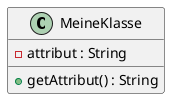
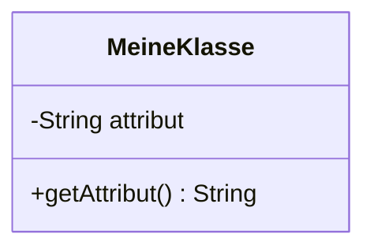

# 📊 UML-Diagramme für OOP-Konzepte

Hier finden Sie **umfassende grafische Darstellungen** der OOP-Konzepte mit verschiedenen Diagrammtypen.

---

## 📁 Verfügbare Diagramm-Formate

### 1. 🎨 PlantUML Klassendiagramme (UML-Standard)

#### **Datei:** `oop-class-diagram.puml`

**Enthält:**
- Vollständiges Klassendiagramm mit Person und Student
- Alle Attribute, Methoden und Konstruktoren
- Vererbungsbeziehung visualisiert
- Notizen zu Konzepten

**Verwendung:**
```bash
# Online unter: https://www.plantuml.com/plantuml/uml/
# Oder mit PlantUML CLI:
plantuml oop-class-diagram.puml
```

#### **Datei:** `oop-object-diagram.puml`

**Enthält:**
- Objektdiagramm mit konkreten Instanzen
- Zeigt Beispielwerte für Person- und Student-Objekte
- Visualisiert den Unterschied zwischen Klasse und Objekt

---

### 2. 🌊 Mermaid Diagramme (GitHub-kompatibel)

**Datei:** `oop-mermaid-diagrams.md`

**Enthält 6 verschiedene Darstellungen:**

1. **Vollständiges Klassendiagramm**
   - Alle Klassen mit vollständigen Details
   - Attribute, Methoden, Konstruktoren

2. **Vereinfachtes Klassendiagramm**
   - Übersichtliche Darstellung
   - Nur wichtigste Elemente

3. **Mit Beziehungen und Notizen**
   - Zeigt Verwendungsbeziehungen (Main → Person/Student)
   - Erklärende Notizen

4. **Hierarchie mit Beispiel-Objekten**
   - Baumartige Darstellung
   - Zeigt Klassen und ihre Instanzen

5. **Vererbungshierarchie mit Methoden**
   - Fokus auf geerbte und überschriebene Methoden
   - Emoji-Icons für bessere Visualisierung

6. **OOP-Prinzipien Übersicht**
   - Mindmap der vier OOP-Grundprinzipien
   - Konzeptionelle Übersicht

**Zusätzlich:**
- Sequenzdiagramm für Polymorphismus
- Code-Mapping Beispiele
- Vererbungskonzept visualisiert

**Verwendung:**
- Funktioniert direkt auf GitHub
- In VS Code mit Mermaid-Extension
- Mermaid Live Editor: https://mermaid.live/

---

### 3. 📝 ASCII-Art Diagramme (Text-basiert)

**Datei:** `oop-ascii-diagrams.txt`

**Enthält:**
- Vollständiges UML-Klassendiagramm in ASCII
- Vererbungshierarchie
- Objektdiagramm mit Beispielinstanzen
- Die vier OOP-Grundprinzipien erklärt
- Zugriffsmodifikatoren-Tabelle
- Methodenüberschreibung visualisiert
- Konstruktoren-Übersicht
- Wichtige Schlüsselwörter

**Vorteile:**
- Funktioniert in jedem Text-Editor
- Keine speziellen Tools nötig
- Perfekt für Ausdrucke

**Ansehen:**
```bash
cat oop-ascii-diagrams.txt
# oder
less oop-ascii-diagrams.txt
```

---

## 🎯 Welches Diagramm sollten Sie verwenden?

| Anwendungsfall | Empfohlenes Format | Datei |
|----------------|-------------------|-------|
| **GitHub/GitLab** | Mermaid | `oop-mermaid-diagrams.md` |
| **Akademische Arbeit** | PlantUML | `oop-class-diagram.puml` |
| **Präsentation** | Mermaid (Variante 2) | `oop-mermaid-diagrams.md` |
| **Ausdrucken** | ASCII-Art | `oop-ascii-diagrams.txt` |
| **Konzepte lernen** | ASCII-Art | `oop-ascii-diagrams.txt` |
| **Objektinstanzen** | PlantUML Objektdiagramm | `oop-object-diagram.puml` |
| **Schnellreferenz** | Mermaid Vereinfacht | `oop-mermaid-diagrams.md` |
| **Offline arbeiten** | ASCII-Art | `oop-ascii-diagrams.txt` |

---

## 🎓 Was zeigen die Diagramme?

### Klassendiagramm (Class Diagram)

**Zeigt:**
- Struktur der Klassen (Person, Student)
- Attribute (Eigenschaften)
- Methoden (Verhalten)
- Vererbungsbeziehungen
- Zugriffsmodifikatoren

**Liest man so:**
```
┌─────────────────┐
│   KlassenName   │  ← Klassenname
├─────────────────┤
│ - attribut      │  ← Attribute (- = private)
├─────────────────┤
│ + methode()     │  ← Methoden (+ = public)
└─────────────────┘
```

### Objektdiagramm (Object Diagram)

**Zeigt:**
- Konkrete Instanzen (Objekte)
- Tatsächliche Attributwerte
- Zustand zu einem bestimmten Zeitpunkt

**Beispiel:**
```
┌────────────────────┐
│ person2 : Person   │  ← Objektname : Klassentyp
├────────────────────┤
│ name = "Max"       │  ← Konkrete Werte
│ alter = 30         │
└────────────────────┘
```

---

## 🔍 UML-Notation Erklärung

### Zugriffsmodifikatoren

| Symbol | Bedeutung | Java-Code |
|--------|-----------|-----------|
| `+` | public | `public String name` |
| `-` | private | `private String name` |
| `#` | protected | `protected String name` |
| `~` | package | `String name` (kein Modifikator) |

### Beziehungen

| Symbol | Bedeutung | Beispiel |
|--------|-----------|----------|
| `<|--` oder `△──` | Vererbung (Generalisierung) | Student erbt von Person |
| `<--` oder `◇──` | Aggregation | Hat-Beziehung |
| `<..` oder `- -` | Abhängigkeit | Verwendet |
| `──` | Assoziation | Kennt |

### Methoden-Notation

```
+ methodeName(parameter: Typ) : Rückgabetyp
```

**Beispiele:**
- `+ getName() : String` → public Methode, gibt String zurück
- `+ setAlter(alter : int) : void` → public Methode mit Parameter, kein Rückgabewert
- `- berechne() : double` → private Methode, gibt double zurück

---

## 📚 Die vier OOP-Grundprinzipien

Alle Diagramme visualisieren diese Prinzipien:

### 1. 🔒 Kapselung (Encapsulation)

**Im Diagramm:**
- Private Attribute (`-`)
- Public Getter/Setter (`+`)

**Im Code:**
```java
private String name;        // Geschützt
public String getName()     // Zugriff kontrolliert
```

### 2. 🧬 Vererbung (Inheritance)

**Im Diagramm:**
- Pfeil von Student zu Person (`<|--`)
- Student hat alle Person-Eigenschaften + eigene

**Im Code:**
```java
public class Student extends Person {
    // Erbt name, alter, adresse
    // + eigene Attribute
}
```

### 3. 🎭 Polymorphismus (Polymorphism)

**Im Diagramm:**
- `@Override` Annotation bei Methoden
- Gleiche Methodennamen in verschiedenen Klassen

**Im Code:**
```java
Person p = new Student(...);  // Student ist auch Person
p.begruessung();              // Ruft Student-Version auf
```

### 4. 🎯 Abstraktion (Abstraction)

**Im Diagramm:**
- Klasse = abstrakte Beschreibung
- Objekt = konkrete Instanz

**Im Code:**
```java
Person p = new Person("Max", 30);  // Objekt aus Klasse
```

---

## 🚀 Schnellstart

### Option 1: GitHub
Öffnen Sie `oop-mermaid-diagrams.md` auf GitHub → Mermaid wird automatisch gerendert!

### Option 2: VS Code
1. Installieren Sie "Mermaid Preview" oder "PlantUML" Extension
2. Öffnen Sie die entsprechende Datei
3. Drücken Sie `Ctrl+Shift+V` für Vorschau

### Option 3: Terminal
```bash
cat oop-ascii-diagrams.txt
```

### Option 4: Online-Tools
- **PlantUML:** https://www.plantuml.com/plantuml/uml/
- **Mermaid:** https://mermaid.live/

---

## 📖 Lernpfad

Für optimales Lernen empfehlen wir diese Reihenfolge:

1. **README.md** lesen
   - Grundkonzepte verstehen
   - Begriffe lernen

2. **Person.java** studieren
   - Einfache Klasse mit Kapselung
   - Getter/Setter verstehen

3. **Student.java** studieren
   - Vererbung sehen
   - `extends` und `super` verstehen

4. **Mermaid Vereinfacht** (Variante 2) ansehen
   - Visuelle Übersicht
   - Klassenstruktur erkennen

5. **ASCII-Diagramme** durchgehen
   - Alle Details verstehen
   - OOP-Prinzipien verinnerlichen

6. **Main.java** ausführen
   - Konzepte in Aktion sehen
   - Ausgabe analysieren

7. **Vollständige UML-Diagramme** studieren
   - PlantUML oder Mermaid (Variante 1)
   - Alle Details erfassen

---

## 🛠️ Eigene Diagramme erstellen

### Für PlantUML:



### Für Mermaid:



---

## 💡 Tipps

- **PlantUML** für professionelle Dokumentation
- **Mermaid** für GitHub/GitLab/moderne Workflows
- **ASCII** für schnelle Notizen und Ausdrucke
- **Objektdiagramme** zum Verstehen von Instanzen
- **Klassendiagramme** für Architektur-Überblick

---

## 📚 Weitere Ressourcen

- **UML Klassendiagramme:** https://www.uml-diagrams.org/class-diagrams-overview.html
- **PlantUML Dokumentation:** https://plantuml.com/class-diagram
- **Mermaid Dokumentation:** https://mermaid.js.org/syntax/classDiagram.html
- **Java OOP Tutorial:** https://docs.oracle.com/javase/tutorial/java/concepts/

---

## ✅ Checkliste

Nach dem Studium der Diagramme sollten Sie:

- [ ] Den Unterschied zwischen Klasse und Objekt kennen
- [ ] Vererbung (`extends`) verstehen
- [ ] Methodenüberschreibung (`@Override`) erkennen
- [ ] Zugriffsmodifikatoren (`private`, `public`) anwenden können
- [ ] UML-Klassendiagramme lesen können
- [ ] Die vier OOP-Prinzipien erklären können
- [ ] `this` und `super` unterscheiden können
- [ ] Konstruktoren mit Parametern erstellen können

---

**Viel Erfolg beim Lernen der OOP-Konzepte! 🎉**
