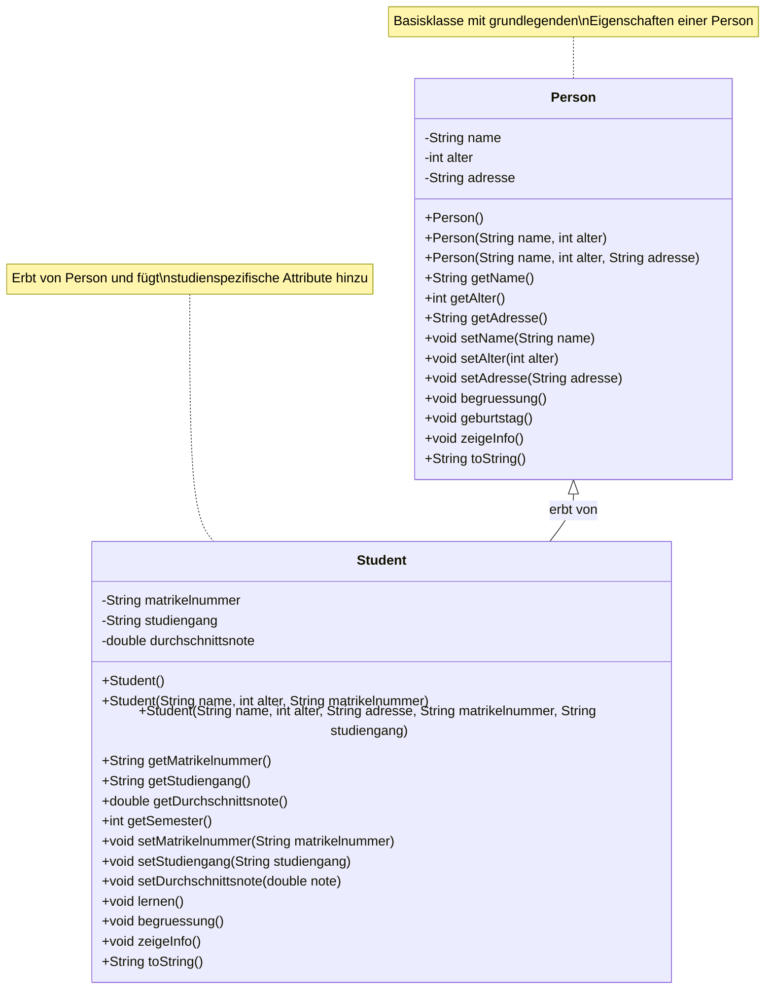
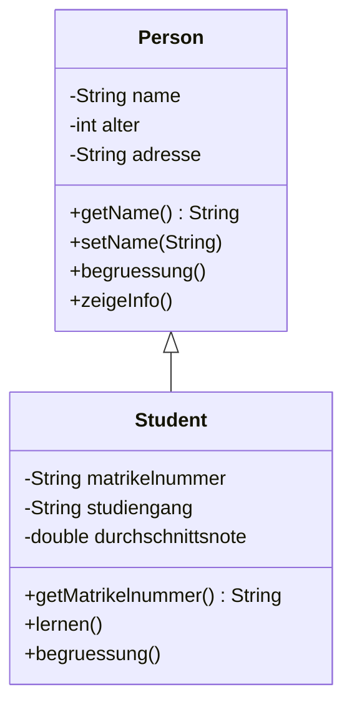
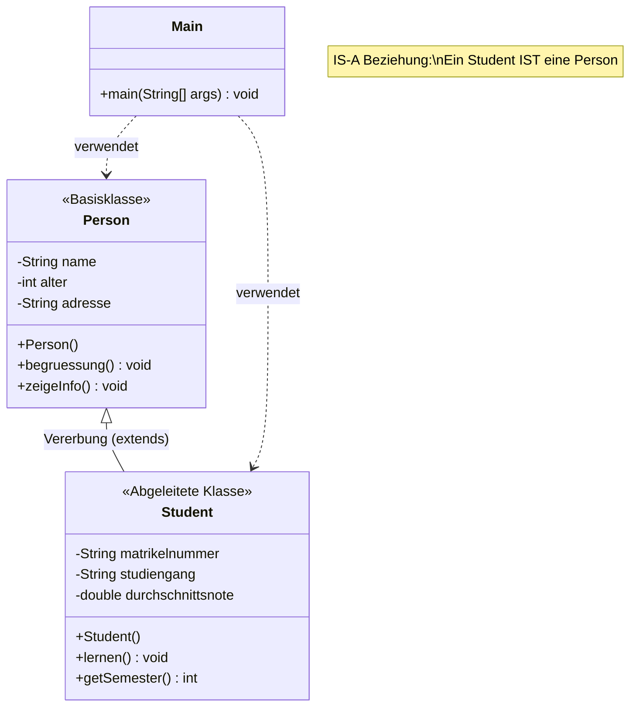
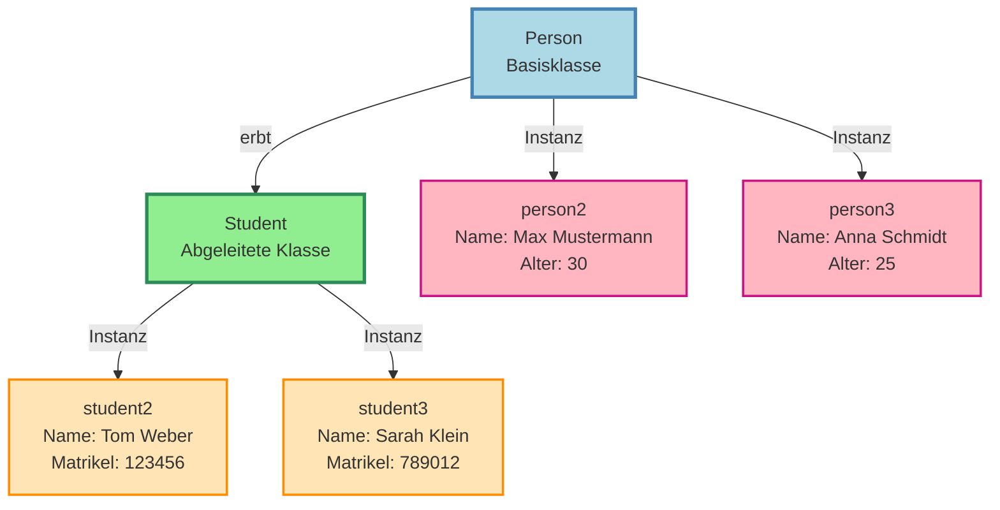
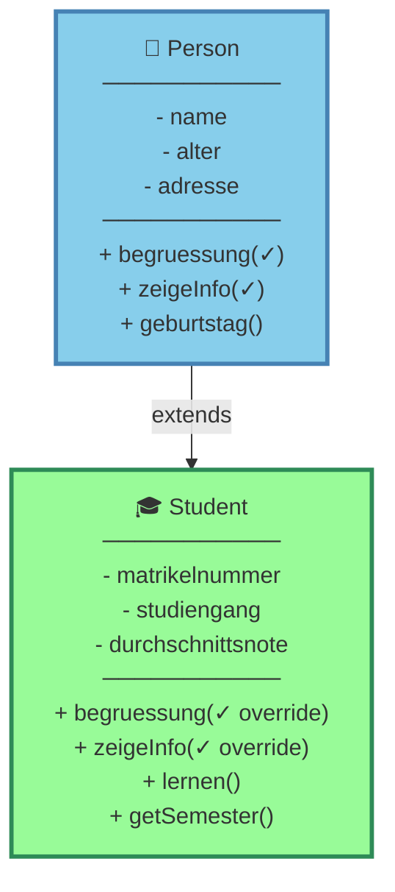
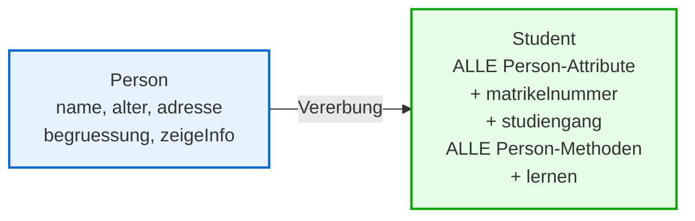
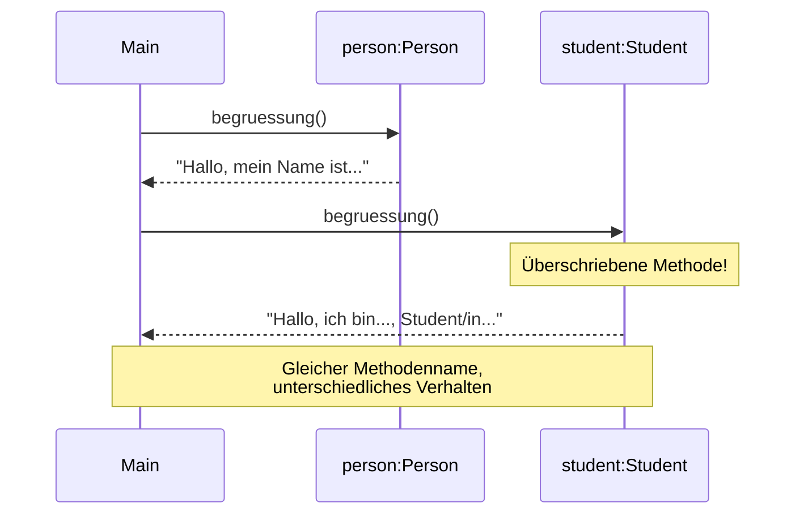
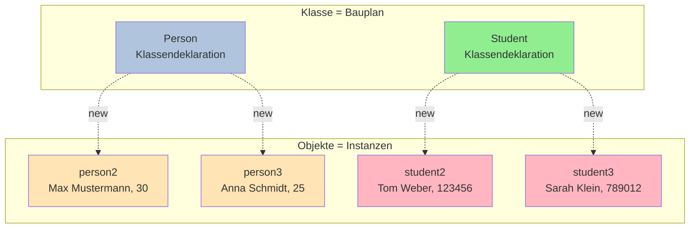

# Mermaid UML-Diagramme für OOP-Konzepte

## Variante 1: Vollständiges Klassendiagramm



## Variante 2: Vereinfachtes Klassendiagramm



## Variante 3: Mit Beziehungen und Notizen



## Variante 4: Hierarchie mit Beispiel-Objekten



## Variante 5: Vererbungshierarchie mit Methoden



## Variante 6: OOP-Prinzipien Übersicht

```mermaid
mindmap
  root((OOP Konzepte))
    Kapselung
      private Attribute
      public Getter/Setter
      Datenschutz
    Vererbung
      extends Person
      Wiederverwendbarkeit
      IS-A Beziehung
    Polymorphismus
      Methodenüberschreibung
      @Override
      begruessung()
    Abstraktion
      Klassen als Bauplan
      Objekte als Instanzen
      toString()
```

## Erklärung der Symbole

| Symbol | Bedeutung |
|--------|-----------|
| `-` | private (nur in der Klasse) |
| `+` | public (überall zugänglich) |
| `#` | protected (in Klasse + Subklassen) |
| `~` | package (im gleichen Package) |
| `<|--` | Vererbung (erbt von) |
| `..>` | Abhängigkeit (verwendet) |
| `--` | Assoziation |

## Code-Mapping

### Person-Klasse

```java
public class Person {          // Klasse Person
    private String name;       // - name : String
    private int alter;         // - alter : int

    public Person() {...}      // + Person()
    public String getName() {...} // + getName() : String
    public void begruessung() {...} // + begruessung() : void
}
```

### Student-Klasse

```java
public class Student extends Person {  // Student <|-- Person
    private String matrikelnummer;     // - matrikelnummer : String

    @Override                          // Methodenüberschreibung
    public void begruessung() {...}    // + begruessung() : void

    public void lernen() {...}         // + lernen() : void
}
```

## Vererbungskonzept visualisiert



## Polymorphismus-Beispiel



## Objektinstanzen


