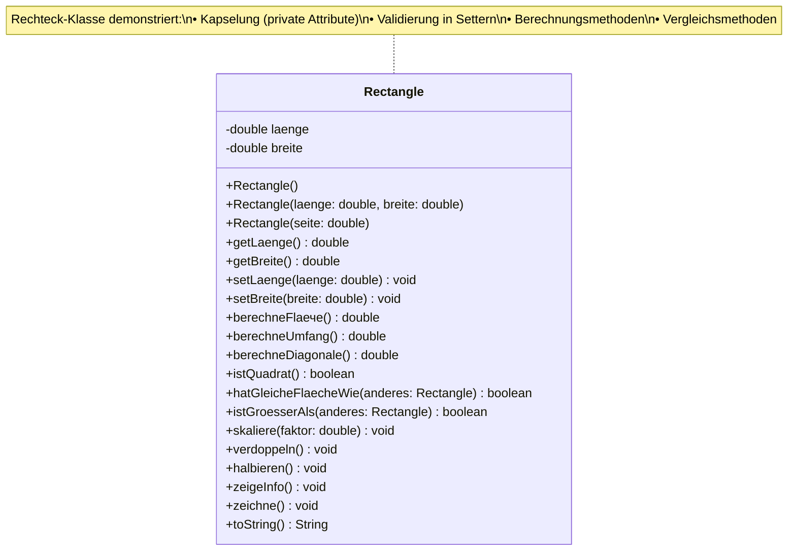
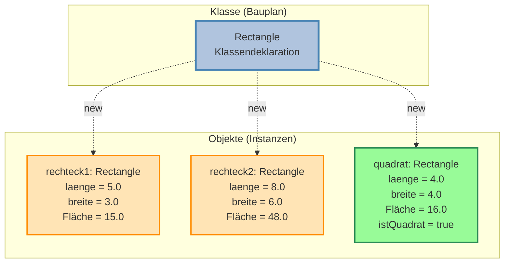
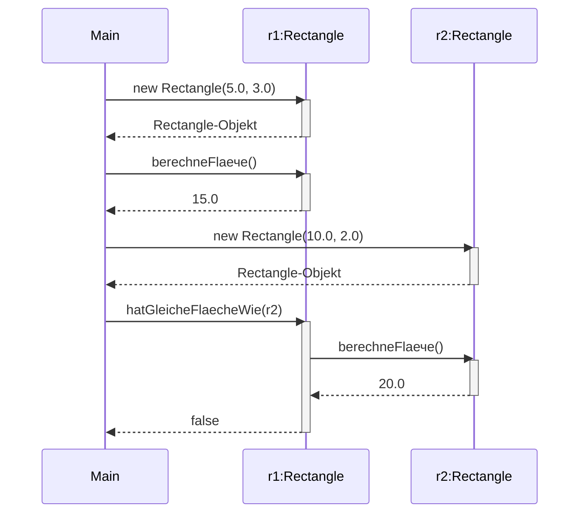
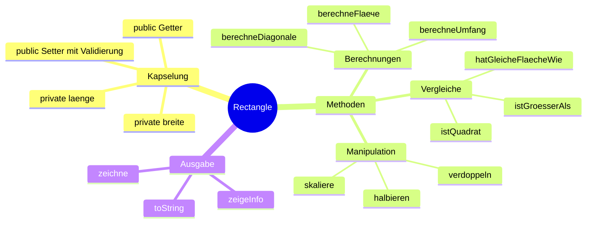
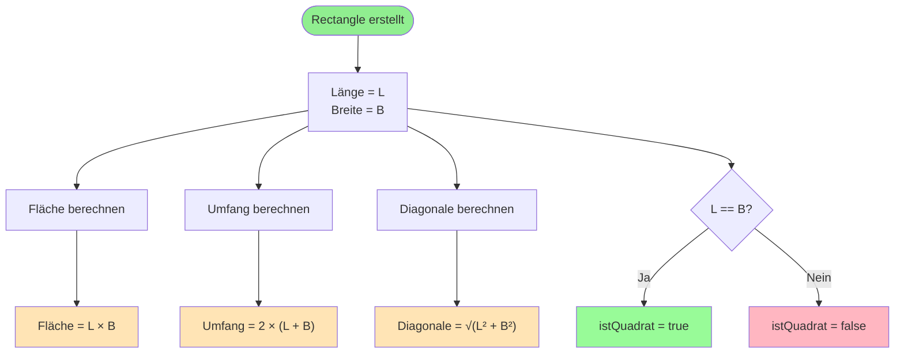
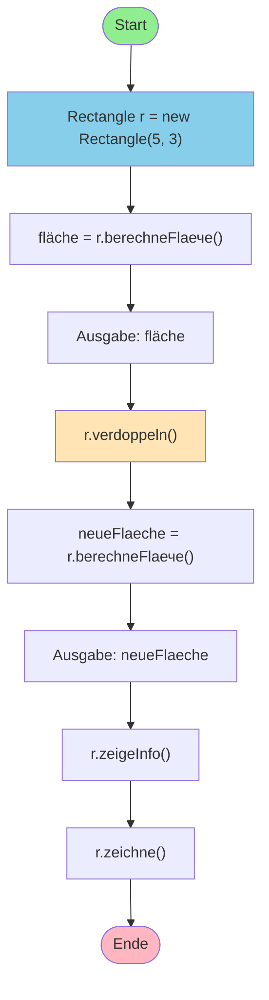
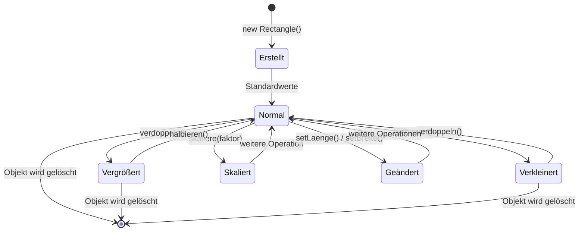
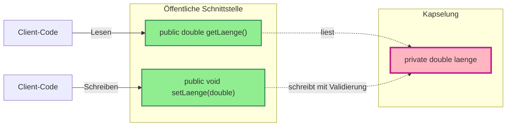

# Rechteck (Rectangle) - UML-Diagramme

## Klassendiagramm



## Objektdiagramm - Beispiele



## Methodenaufrufe - Sequenzdiagramm



## OOP-Prinzipien im Rectangle



## Berechnungsformeln



## Verwendungsbeispiel - Aktivitätsdiagramm



## Vergleich: Rectangle vs. Square

```mermaid
classDiagram
    class Rectangle {
        -double laenge
        -double breite
        +Rectangle(laenge, breite)
        +berechneFlaече() double
    }

    class Square {
        -double seite
        +Square(seite)
        +berechneFlaече() double
    }

    Rectangle <|-- Square : Alternative:\nErben

    note for Rectangle "Allgemeines Rechteck\nLänge ≠ Breite möglich"
    note for Square "Spezielles Rechteck\nLänge = Breite"
```

## Zustandsdiagramm eines Rechtecks



## Getter/Setter Pattern



## Visualisierung der Rectangle-Größen

```
Klein (2 × 1.5):
┌────┐
│    │
└────┘

Mittel (5 × 3):
┌──────────┐
│          │
│          │
│          │
│          │
│          │
└──────────┘

Groß (10 × 6):
┌────────────────────┐
│                    │
│                    │
│                    │
│                    │
│                    │
│                    │
│                    │
│                    │
│                    │
│                    │
└────────────────────┘
```
