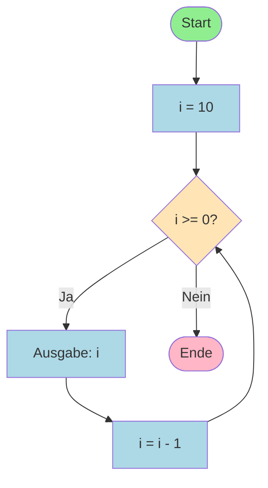

# Aktivitätsdiagramm: Countdown Zählerschleife

## Beschreibung
Dieses Aktivitätsdiagramm stellt die Zählerschleife des Countdown-Programms dar.
Der Countdown beginnt bei 10 und zählt bis 0 herunter.

## Aktivitätsdiagramm



## Ablauf der Schleife

1. **Start**: Programm beginnt
2. **Initialisierung**: Zählervariable i wird auf 10 gesetzt
3. **Bedingungsprüfung**: Ist i >= 0?
   - **Ja**: Führe Schleifenrumpf aus
     - Gib den aktuellen Wert von i aus
     - Dekrementiere i um 1 (i = i - 1)
     - Gehe zurück zur Bedingungsprüfung
   - **Nein**: Verlasse die Schleife
4. **Ende**: Programm endet

## Ausgabe des Programms

```
10
9
8
7
6
5
4
3
2
1
0
```

## Code

```java
public class Countdown {
    public static void main(String[] args) {
        for (int i = 10; i >= 0; i = i - 1) {  // i-- ist auch möglich
            System.out.println(i);
        }
    }
}
```

## Schleifendurchläufe

Die Schleife wird **11 Mal** durchlaufen (für die Werte 10, 9, 8, 7, 6, 5, 4, 3, 2, 1, 0).

| Durchlauf | Wert von i | Bedingung i >= 0 | Aktion |
|-----------|------------|------------------|---------|
| 1 | 10 | true | Ausgabe: 10 |
| 2 | 9 | true | Ausgabe: 9 |
| 3 | 8 | true | Ausgabe: 8 |
| 4 | 7 | true | Ausgabe: 7 |
| 5 | 6 | true | Ausgabe: 6 |
| 6 | 5 | true | Ausgabe: 5 |
| 7 | 4 | true | Ausgabe: 4 |
| 8 | 3 | true | Ausgabe: 3 |
| 9 | 2 | true | Ausgabe: 2 |
| 10 | 1 | true | Ausgabe: 1 |
| 11 | 0 | true | Ausgabe: 0 |
| 12 | -1 | false | Schleife beenden |
```
