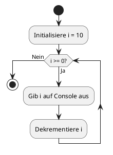

# 📊 Grafische Darstellungen - Countdown Zählerschleife

Hier finden Sie **verschiedene grafische Darstellungen** des Countdown-Programms als Aktivitätsdiagramme.
Wählen Sie die Variante, die am besten zu Ihren Bedürfnissen passt!

---

## 📁 Verfügbare Diagramm-Formate

### 1. 🎨 PlantUML Aktivitätsdiagramm (UML-Standard)

**Datei:** `countdown-activity.puml`

**Verwendung:**
- Standard UML-Notation
- Kann mit PlantUML-Tools gerendert werden
- Professionelle Darstellung für Dokumentationen
- Ideal für akademische Arbeiten

**So verwenden Sie es:**
```bash
# Mit PlantUML CLI (falls installiert)
plantuml countdown-activity.puml

# Online unter: https://www.plantuml.com/plantuml/uml/
# Kopieren Sie den Inhalt der .puml Datei dort ein
```

**Vorschau der Syntax:**


---

### 2. 🌊 Mermaid Diagramme (GitHub-kompatibel)

**Datei:** `countdown-mermaid-detailed.md`

**Enthält 5 verschiedene Varianten:**

#### Variante 1: Klassisches Aktivitätsdiagramm
- Übersichtlicher Ablauf mit Farben
- Zeigt Start, Bedingung, Aktionen und Ende

#### Variante 2: Mit Schleifenzähler-Annotation
- Detaillierte Beschriftung der Schritte
- Zeigt Schleifenbeginn und -ende explizit
- Emojis für bessere Visualisierung (🚀 Start, 🏁 Ende, ⟲ Schleife)

#### Variante 3: Horizontaler Ablauf
- Kompakte Darstellung von links nach rechts
- Ideal für Präsentationen

#### Variante 4: Mit allen 11 Iterationen
- Zeigt jeden einzelnen Schleifendurchlauf
- Verdeutlicht den kompletten Ablauf
- Gut zum Nachvollziehen der einzelnen Schritte

#### Variante 5: Zustandsdiagramm-Stil
- Alternative Darstellung als Zustandsautomat
- Zeigt die Zustände des Programms

**Verwendung:**
- Funktioniert direkt auf GitHub
- Funktioniert in vielen Markdown-Editoren (VS Code, Obsidian, etc.)
- Kann mit Mermaid Live Editor bearbeitet werden: https://mermaid.live/

---

### 3. 📝 ASCII-Art Diagramm (Text-basiert)

**Datei:** `countdown-ascii-diagram.txt`

**Besonderheiten:**
- Funktioniert in jedem Text-Editor
- Keine speziellen Tools nötig
- Kann direkt in der Console angezeigt werden
- Perfekt für Ausdrucke

**Enthält:**
- Vollständiges Flussdiagramm mit Box-Drawing-Zeichen
- Detaillierte Ablauftabelle aller 11 Iterationen
- Erklärung der Schleifenstruktur
- Kompakt-Darstellung
- Liste der Merkmale der Zählerschleife

**Ansehen:**
```bash
cat countdown-ascii-diagram.txt
# oder
less countdown-ascii-diagram.txt
```

---

### 4. 📄 Einfaches Aktivitätsdiagramm

**Datei:** `Countdown-Aktivitaetsdiagramm.md`

**Eigenschaften:**
- Einfaches Mermaid-Diagramm
- Mit Ablaufbeschreibung und Erklärungen
- Gut für Einsteiger geeignet

---

## 🎯 Welches Diagramm sollten Sie verwenden?

| Anwendungsfall | Empfohlenes Format | Datei |
|----------------|-------------------|-------|
| **GitHub README** | Mermaid | `countdown-mermaid-detailed.md` |
| **Akademische Arbeit** | PlantUML | `countdown-activity.puml` |
| **Präsentation** | Mermaid (Variante 3) | `countdown-mermaid-detailed.md` |
| **Ausdrucken** | ASCII-Art | `countdown-ascii-diagram.txt` |
| **Schnelle Übersicht** | Einfaches Diagramm | `Countdown-Aktivitaetsdiagramm.md` |
| **Lernzwecke** | ASCII-Art oder Variante 4 | Beide! |
| **Offline arbeiten** | ASCII-Art | `countdown-ascii-diagram.txt` |

---

## 🔍 Anatomie der For-Schleife

Alle Diagramme visualisieren diese Schleifenstruktur:

```java
for (int i = 10;  i >= 0;  i = i - 1) {
     └────┬────┘   └──┬──┘  └────┬────┘
          │           │          │
    Startwert    Bedingung   Inkrement
```

### Die drei Komponenten:

1. **Startwert (Initialisierung)**
   - `int i = 10`
   - Wird **einmal** am Anfang ausgeführt
   - Deklariert und initialisiert die Zählervariable

2. **Bedingung (Endwert)**
   - `i >= 0`
   - Wird **vor jedem** Durchlauf geprüft
   - Bei `true`: Schleife wird ausgeführt
   - Bei `false`: Schleife wird beendet

3. **Inkrement (Wertveränderung)**
   - `i = i - 1` (oder `i--`)
   - Wird **nach jedem** Durchlauf ausgeführt
   - Verändert die Zählervariable

---

## 📊 Visualisierungsvergleich

### PlantUML Vorteile:
✅ UML-konform und professionell
✅ Viele Styling-Optionen
✅ Gute Tool-Unterstützung

### Mermaid Vorteile:
✅ Direkt in GitHub/GitLab sichtbar
✅ Kein zusätzliches Tool nötig
✅ Einfache Syntax
✅ Viele verschiedene Diagrammtypen

### ASCII-Art Vorteile:
✅ Funktioniert überall
✅ Keine Abhängigkeiten
✅ Perfekt für Dokumentation
✅ Druckfreundlich

---

## 🚀 Schnellstart

### Diagramm auf GitHub ansehen
1. Öffnen Sie `countdown-mermaid-detailed.md`
2. GitHub rendert Mermaid automatisch!

### Diagramm lokal bearbeiten (VS Code)
1. Installieren Sie die "Mermaid Preview" Extension
2. Öffnen Sie eine .md Datei mit Mermaid-Code
3. Drücken Sie `Ctrl+Shift+V` für Vorschau

### ASCII-Diagramm ansehen
```bash
cat examples/zaehler-schleife/countdown-ascii-diagram.txt
```

---

## 📚 Weitere Ressourcen

- **PlantUML Dokumentation:** https://plantuml.com/activity-diagram-beta
- **Mermaid Dokumentation:** https://mermaid.js.org/syntax/flowchart.html
- **UML Aktivitätsdiagramme:** https://www.uml-diagrams.org/activity-diagrams.html

---

## 🎓 Lernziele

Nach dem Studieren dieser Diagramme sollten Sie verstehen:

- ✓ Wie eine Zählerschleife funktioniert
- ✓ Die drei Komponenten einer for-Schleife (Init, Bedingung, Inkrement)
- ✓ Dass die Bedingung **vor** jedem Durchlauf geprüft wird (kopfgesteuert)
- ✓ Wie viele Durchläufe die Schleife macht (hier: 11)
- ✓ Den Unterschied zwischen Inkrement (++) und Dekrement (--)
- ✓ Wie man Kontrollstrukturen grafisch darstellt

---

**Viel Erfolg beim Lernen! 🎉**
