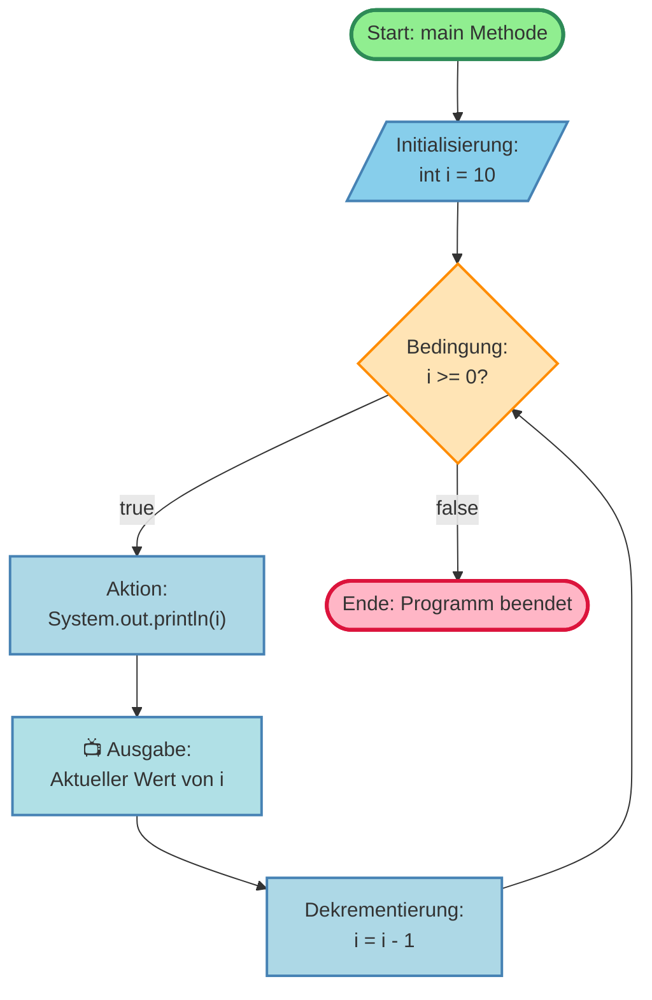
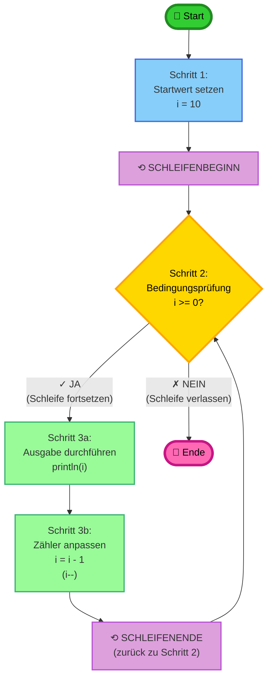
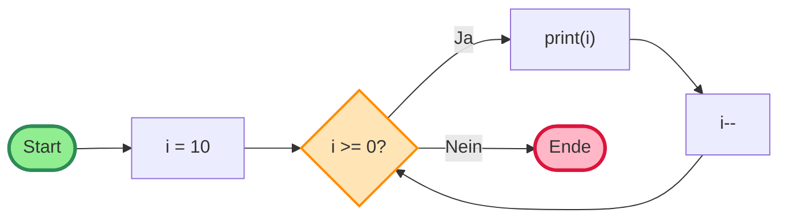
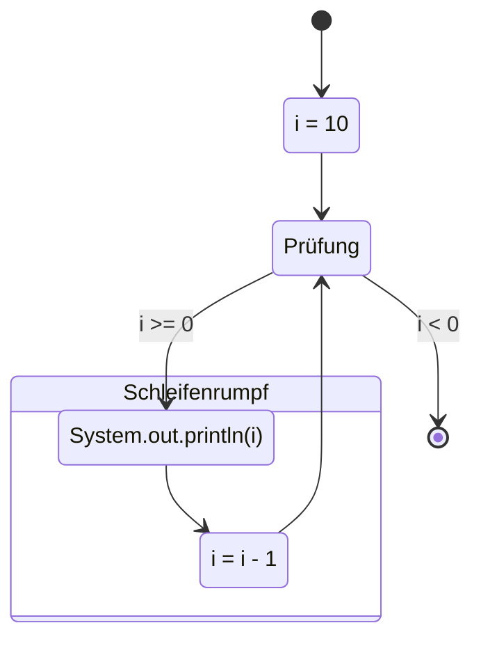

# Detailliertes Aktivitätsdiagramm - Countdown Zählerschleife

## Variante 1: Klassisches Aktivitätsdiagramm



## Variante 2: Mit Schleifenzähler-Annotation



## Variante 3: Horizontaler Ablauf



## Variante 4: Mit allen 11 Iterationen dargestellt

```mermaid
graph TD
    Start([Start]) --> I0["i = 10"]
    I0 --> C0{"i ≥ 0?<br/>10 ≥ 0"}
    C0 -->|Ja| P0["Ausgabe: 10"]
    P0 --> D0["i = 9"]

    D0 --> C1{"i ≥ 0?<br/>9 ≥ 0"}
    C1 -->|Ja| P1["Ausgabe: 9"]
    P1 --> D1["i = 8"]

    D1 --> C2{"i ≥ 0?<br/>8 ≥ 0"}
    C2 -->|Ja| P2["Ausgabe: 8"]
    P2 --> D2["i = 7"]

    D2 --> Dots1["..."]
    Dots1 --> C9{"i ≥ 0?<br/>1 ≥ 0"}
    C9 -->|Ja| P9["Ausgabe: 1"]
    P9 --> D9["i = 0"]

    D9 --> C10{"i ≥ 0?<br/>0 ≥ 0"}
    C10 -->|Ja| P10["Ausgabe: 0"]
    P10 --> D10["i = -1"]

    D10 --> C11{"i ≥ 0?<br/>-1 ≥ 0"}
    C11 -->|Nein| End([Ende])

    style Start fill:#90EE90
    style End fill:#FFB6C6
    style C0 fill:#FFE4B5
    style C1 fill:#FFE4B5
    style C2 fill:#FFE4B5
    style C9 fill:#FFE4B5
    style C10 fill:#FFE4B5
    style C11 fill:#FFE4B5
```



## Variante 5: Zustandsdiagramm-Stil



## Code-Referenz

```java
public class Countdown {
    public static void main(String[] args) {
        // Schritt 1: Initialisierung
        for (int i = 10;
             // Schritt 2: Bedingungsprüfung
             i >= 0;
             // Schritt 3b: Wertveränderung
             i = i - 1) {

            // Schritt 3a: Schleifenrumpf
            System.out.println(i);
        }
    }
}
```

## Ablauf-Tabelle

| Iteration | Vor Bedingung | Bedingung | Aktion | Nach Dekrement |
|-----------|---------------|-----------|---------|----------------|
| 1 | i = 10 | 10 ≥ 0 ✓ | print(10) | i = 9 |
| 2 | i = 9 | 9 ≥ 0 ✓ | print(9) | i = 8 |
| 3 | i = 8 | 8 ≥ 0 ✓ | print(8) | i = 7 |
| 4 | i = 7 | 7 ≥ 0 ✓ | print(7) | i = 6 |
| 5 | i = 6 | 6 ≥ 0 ✓ | print(6) | i = 5 |
| 6 | i = 5 | 5 ≥ 0 ✓ | print(5) | i = 4 |
| 7 | i = 4 | 4 ≥ 0 ✓ | print(4) | i = 3 |
| 8 | i = 3 | 3 ≥ 0 ✓ | print(3) | i = 2 |
| 9 | i = 2 | 2 ≥ 0 ✓ | print(2) | i = 1 |
| 10 | i = 1 | 1 ≥ 0 ✓ | print(1) | i = 0 |
| 11 | i = 0 | 0 ≥ 0 ✓ | print(0) | i = -1 |
| 12 | i = -1 | -1 ≥ 0 ✗ | **STOP** | - |
